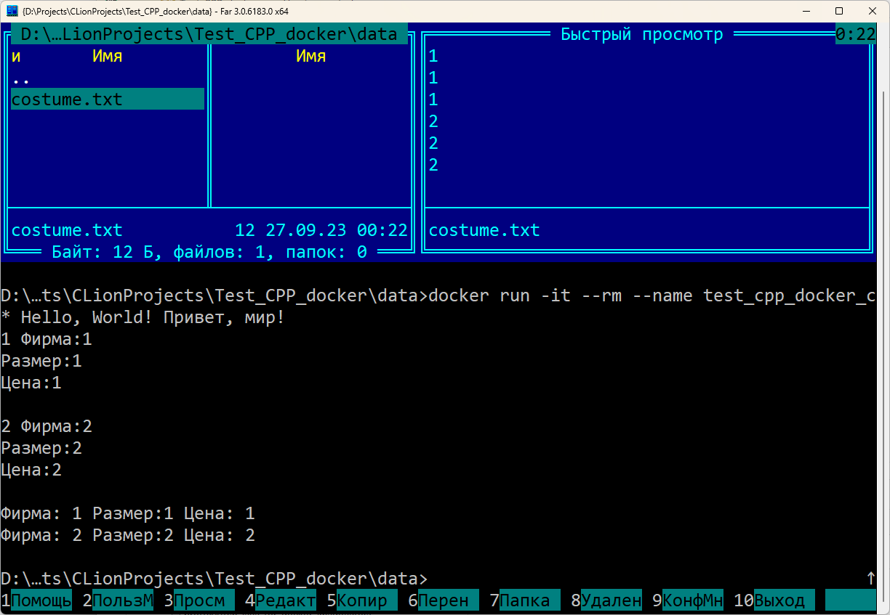

# Test_CPP_docker
Создание программы на C++ для Docker с общей папкой



**Команды в консоли:**

```
docker run -it --rm --name test_cpp_docker_container -v D:/Projects/CLionProjects/Test_CPP_docker/data:/opt/Test_CPP_docker/data proffix4/test_cpp_docker_image
```

*Видео:*
https://youtu.be/1eo6FIoHIaI